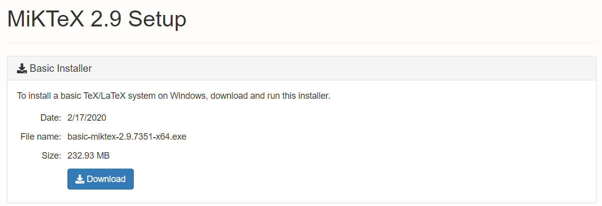
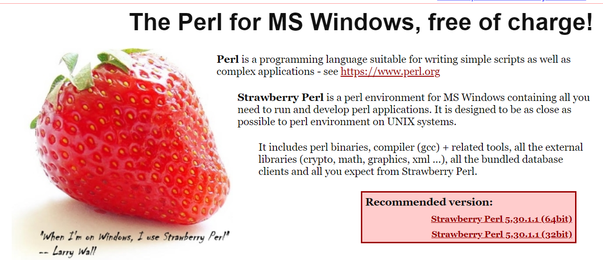
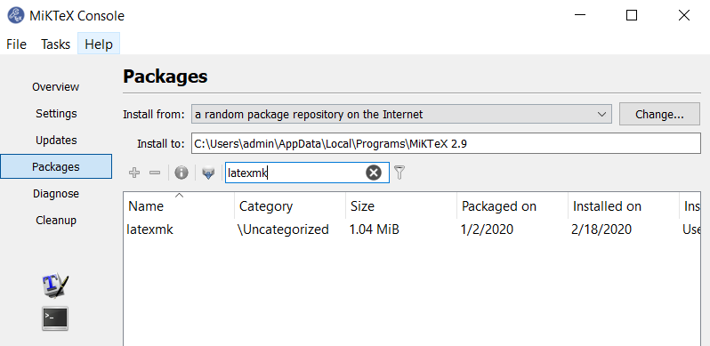
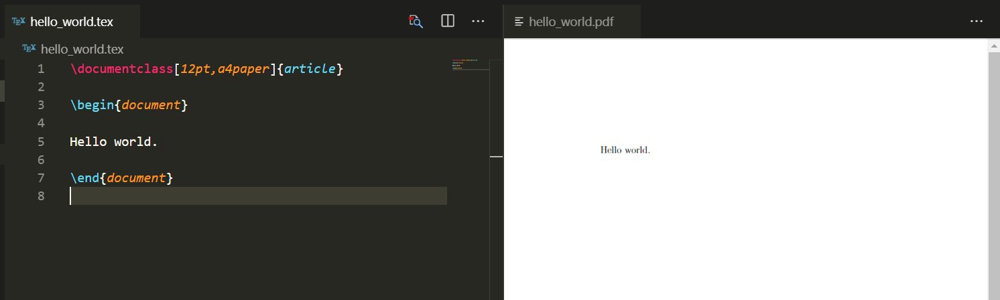

```python
# LaTeX configuration for Visual Studio Code
```


```python
1. Download MikTeX from the official site https://miktex.org/2.9/setup.
Optionally a distribution such as BasicTeX or TeXLive could be installed (in case of lack of space and different OS), but it is recommended to download the MikTeX if possible. After downloading, perform the installation.
```



2. Download and install the Strawberry Perl program from the official site 
   http://strawberryperl.com.



3. Install the LaTeX Workshop extension from extension marketplace in VSC.

4. Open the MikTeX Console and navigate to packages. Search for 'latexmk' package, download and install.



5. Restart the VSC and enable extensions.

6. Create new file with .tex extension and copy the following code:


```python
\documentclass[12pt,a4paper]{article}

\begin{document}

Hello world.

\end{document}
```

7. Via VSC command help choose 'Build LaTeX project' and preview the builded .pdf file.


